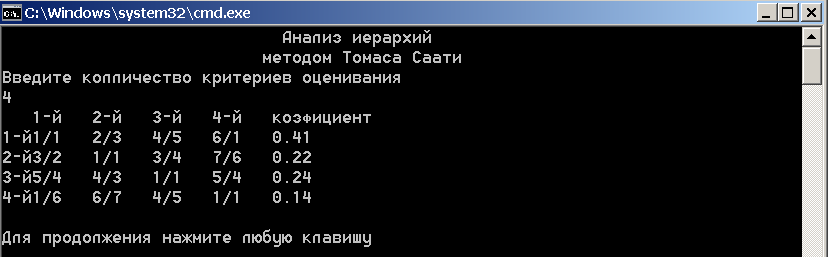

# hierarchyAnalysis
Программа предназначена для определения весовых коэффициентов
критериев сравнения методом анализа иерархий Томаса Саати для одного уровня.

-
Программа создана в среде разработки Microsoft Visual Studio 2015.
-
Чтобы открыть код программы и запустить его из среды разработки,
необходимо открыть файл "hierarchyAnalysis/hierarchyAnalysis.sln" через Microsoft Visual Studio 2015.
Запуск программы осуществляется комбинацией клавишь "Ctr + f5".
-
Можно запустить программу напрямую открыв файл "hierarchyAnalysis/Debug/hierarchyAnalysis.exe".
-
